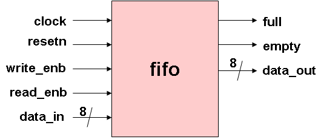

# FIFO Basics – SyncFIFO-IP
------------------------------------------------------------------------------------------------------------------------------------------
## 📘 What is a FIFO?

FIFO stands for **First-In, First-Out**. It is a data buffer or queue in which the **first data written is the first data read** — like a line of people: the first person to enter is the first one to leave.

In digital logic, a FIFO is used to temporarily store data, especially when there is a mismatch in data rate between producer and consumer.

------------------------------------------------------------------------------------------------------------------------------------------

## ⚙️ Applications of FIFO

- **PCIe RX pipelines** (burst data buffering)
- **UARTs** (TX and RX buffers)
- **AXI4-Stream** or other protocol interfaces
- **DMA Engines**
- **Clock domain crossing** (Async FIFO)
- **Video and audio buffering**

-----------------------------------------------------------------------------------------------------------------------------------------

## 🧩 FIFO Components

| Component       | Description                                                 |
|------------------|-------------------------------------------------------------|
| `clk`            | Clock signal                                                |
| `cs`             | Chip Select – activates FIFO                                |
| `rst`            | Reset signal – clears pointers and memory                   |
| `wr_en`          | Write Enable – triggers write on active `clk` edge          |
| `rd_en`          | Read Enable – triggers read on active `clk` edge            |
| `data_in`        | Input data to be written                                    |
| `data_out`       | Output data read                                            |
| `wr_ptr`         | Write pointer – next location to write data                 |
| `rd_ptr`         | Read pointer – next location to read data                   |
| `memory array`   | Storage (usually array of registers)                        |
| `full`           | Flag when FIFO is full – disables write                     |
| `empty`          | Flag when FIFO is empty – disables read                     |

-----------------------------------------------------------------------------------------------------------------------------------------

## 🧠 FIFO Block Diagram




------------------------------------------------------------------------------------------------------------------------------------------

## 🔁 FIFO Operation – Simple Example

Let's simulate FIFO operation with 4-depth size:

### Initial State
- `wr_ptr = 0`, `rd_ptr = 0`
- FIFO is **empty**

### Step 1: Write `0xAA`
- `data_in = 0xAA`, `wr_en = 1`
- Stored in `MEM[0]`
- `wr_ptr = 1`

### Step 2: Write `0xBB`
- `data_in = 0xBB`, `wr_en = 1`
- Stored in `MEM[1]`
- `wr_ptr = 2`

### Step 3: Read
- `rd_en = 1`
- Output = `MEM[0] = 0xAA`
- `rd_ptr = 1`

### Step 4: Write `0xCC`
- `data_in = 0xCC`, `wr_en = 1`
- Stored in `MEM[2]`
- `wr_ptr = 3`

-----------------------------------------------------------------------------------------------------------------------------------------
## 🚦 Full and Empty Logic

```verilog
empty = (wr_ptr == rd_ptr);
full  = ((wr_ptr + 1) % DEPTH) == rd_ptr;
------------------------------------------------------------------------------------------------------------------------------------------
Use modulo arithmetic to wrap pointers in circular fashion.

Ensure full/empty logic is one cycle ahead to prevent overwrite/read underflow.

------------------------------------------------------------------------------------------------------------------------------------------
🧪 FIFO Interview Questions

How does a synchronous FIFO detect full and empty?
→ It uses wr_ptr and rd_ptr comparison. If both are equal → empty = 1.
If (wr_ptr + 1) % DEPTH == rd_ptr → full = 1.

How would you handle pointer wrap-around?
→ Use modulo logic in Verilog to wrap around:
wr_ptr = (wr_ptr + 1) % DEPTH;
rd_ptr = (rd_ptr + 1) % DEPTH;

What bugs can occur if full/empty detection is wrong?
→

Overwriting unread data (if writing when full)

Reading garbage data (if reading when empty)

Pointer misalignment, leading to corruption

✅ Summary
A FIFO is essential for buffering data in VLSI systems — from UARTs to PCIe pipelines. Understanding pointers, control logic, and status flags will help you design a robust FIFO module. This theory will directly guide your RTL module in the next step.
